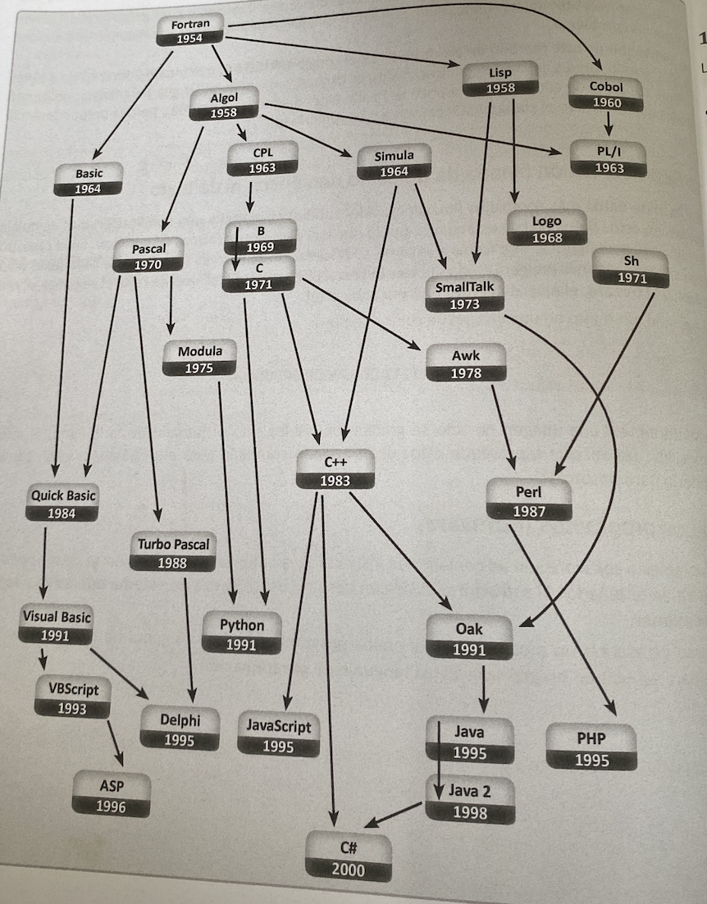

# Lenguajes de programación

## 1.11 Lenguajes de programación

Sirve para escribir programas y permite la comunicación usuario (programador) versus máquina (PC). Existen tres tipos de lenguajes de programación y dependiente de la máquina:

### Lenguaje de máquina
Programación binaria, difícil de programar y dependiente de la máquina, necesita ser traducido al lenguaje técnicos.

### Lenguaje de bajo nivel (ensamblador)
Usa símbolos nemotécnicos de máquina y sigue siendo dependiente de la máquina aunque es más fácil de programar y dependiente de la máquina.

### Lenguaje de alto nivel
Cercano al lenguaje natural, tiempo de programación relativamente corto, independiente de la máquina. A continuación se muestra un plano de la evolución de los lenguajes de programación de alto nivel.

## Evolución histórica de los lenguajes de programación

## Traductores del lenguaje

Son programas que traducen código máquina. Los traductores se dividen en:

### Intérpretes
Traducción línea a línea del código máquina.

### Compiladores
Traducen rápida.

## Ciclo de vida

La construcción de un software:

### Requerimiento
Enumerar

### Análisis
¿Qué? (Entender el problema)

### Diseño
¿Cómo? (Resolver el problema)

### Implementación
¿Con qué herramientas?

### Pruebas
¿Funciona correctamente?

### Despliegue
¿Instalación del software?

# Traductores del lenguaje de programación
Son programas que traducen los códigos fuentes (programas escritos en un lenguaje de alto nivel) a
código máquina.

Los traductores se dividen en:
• Intérpretes: Traducción y ejecución secuencial (línea por línea), ejecución lenta.
• Compiladores: Traduce el código fuente a programa objeto (ejecutable código máquina). Ejecución rápida.

# Ciclo de vida de un software
La construcción de un software, por más pequeño que sea, involucra las siguientes etapas:
• Requerimiento: Enunciado del problema a resolver.
• Análisis: ¿Qué? (Entender el problema - entrada - proceso - salida).
• Diseño: ¿Cómo? (Resolver el problema - algoritmo - diagrama de flujo - diseño de interfaz de usuario).
• Implementación: ¿Hacerlo? (Codificación / Programar).
• Pruebas: ¿Funciona? (Verificar / Comprobar).
• Despliegue: ¿Instalar? (Distribuir el programa).

