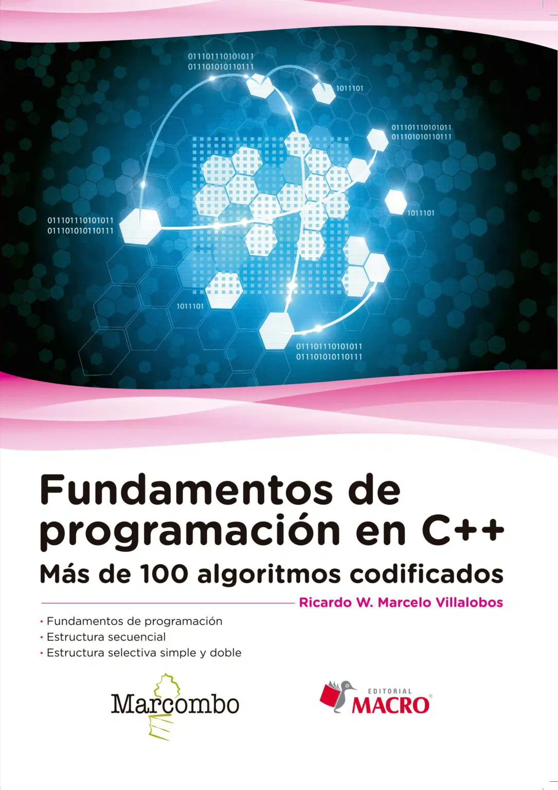

# Fundamentos de la Programación en C++

Notes and scripts of the book "Fundamentos de la programación en C++" by Ricardo Walter & Marcelo Villalobos published by Editorial Macro & Macrombo

<div align="center">
  
</div>

## Índice de Capítulos

### [Capítulo 1: Fundamentos de Programación](./Capítulos/Capítulo_1_Fundamentos-de-programación)
Introducción a los conceptos básicos de la programación y C++.

### [Capítulo 2: Estructura Secuencial](./Capítulos/Capítulo_2_Estructura-secuencial)
Programas que ejecutan instrucciones una tras otra en orden lineal.

### [Capítulo 3: Estructura Selectiva Simple y Doble](./Capítulos/Capítulo_3_Estrucutra-selectiva-simple-y-doble)
Estructuras de control condicionales: if, if-else y toma de decisiones.

### [Capítulo 4: Estructura Selectiva Múltiple](./Capítulos/Capítulo_4_Estructura-selectiva-múltiple)
Estructuras switch-case y decisiones múltiples.

### [Capítulo 5: Estructura Repetitiva "Mientras"](./Capítulos/Capítulo_5_Estructura-repetitiva-<Mientras>)
Bucles while y do-while para repetir instrucciones.

### [Capítulo 6: Estructura Repetitiva "Para"](./Capítulos/Capítulo_6_Estructura-repetitiva-<Para>)
Bucles for y iteraciones controladas.

### [Capítulo 7: Estructuras de Datos. Arreglos (vectores y matrices)](./Capítulos/Capítulo_7_Estructuras-de-datos-Arreglos-(vectores-y-matrices))
Vectores, matrices y manejo de arrays multidimensionales.

### [Capítulo 8: Cadenas de Caracteres](./Capítulos/Capítulo_8_Cadenas-de-caracteres)
Manejo de strings y procesamiento de texto.

### [Capítulo 9: SubAlgoritmos (procedimientos y funciones)](./Capítulos/Capítulo_9_SubAlgoritmos-(procedimientos-y-funciones))


```
@book{villalobos2017,
  title={Fundamentos de programación en C++},
  author={Walter, Ricardo and Villalobos, Marcelo},
  isbn={978-8426724533},
  edition={1},
  year={2017},
  month={may},
  publisher={Marcombo}
}
```